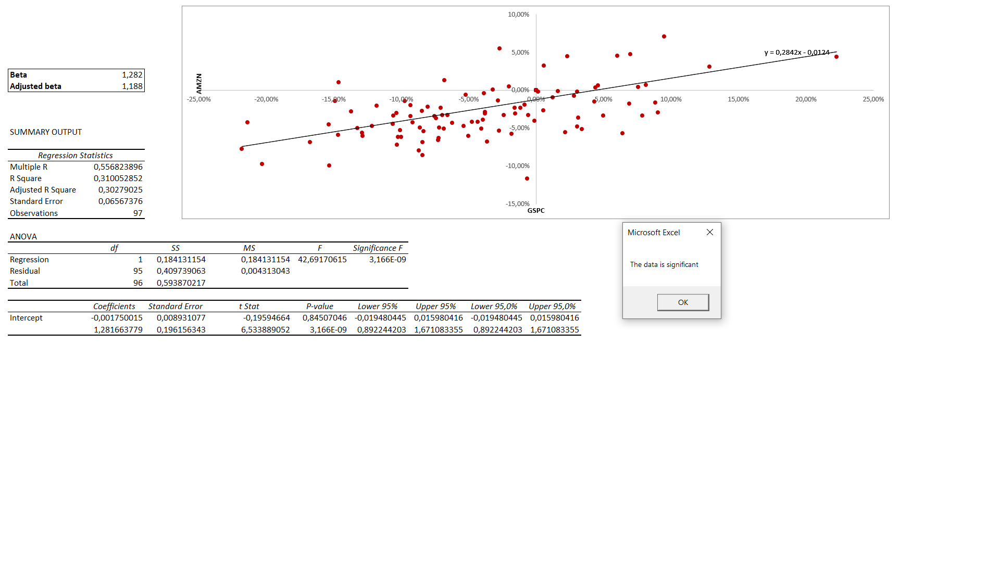

Welcome to my beta calculator!

This program pulls monthly stock price, index market price and risk-free rate to calculate the beta for any number of stocks.

Save the beta_base file on your computer. 
Open the python file and enter the desired stock ticker and location of the beta_base file.
The program will create a new excel file based on the beta_base. 
When opened, click the ReplaceData-button.
The VBA code will create a regression analysis and tell the user if the data is significant. 

Enjoy!

All data is retrieved from https://finance.yahoo.com/.

Created by Arvid Landmark, September 2019.

Preview:

